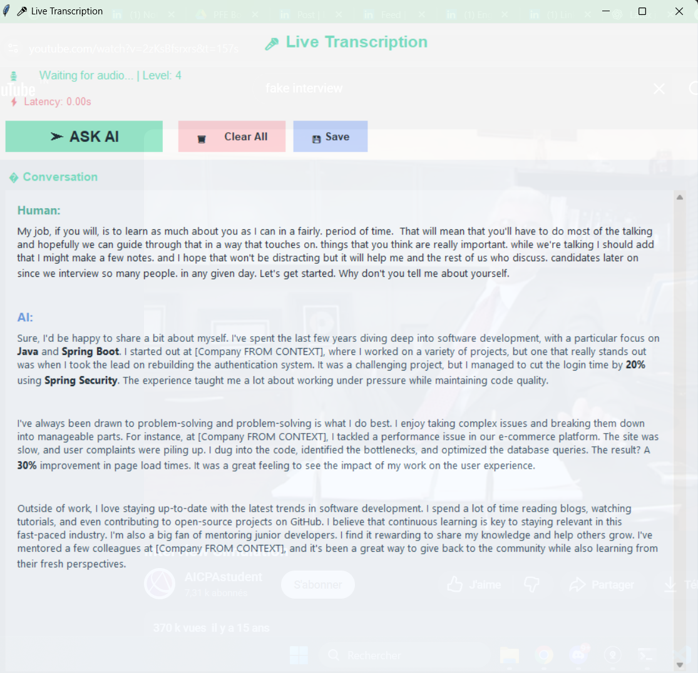

# AI Interview Assistant with Real-Time Transcription

An intelligent AI interview assistant that transcribes system audio in real-time, retrieves relevant context from your CV/projects, and generates natural, ready-to-speak answers using RAG (Retrieval-Augmented Generation).



## Features

- **🎧 Real-Time Transcription**: Automatically captures and transcribes system audio (interviewer questions via Zoom, Teams, Meet, etc.)
- **🤖 Personalized AI Responses**: Generates authentic and conversational interview answers using your real context
- **📚 Integrated RAG System**: Automatically retrieves relevant context from your CV, projects, and experiences
- **🎨 Modern Glassmorphism UI**: Elegant user interface with pastel palette and transparency
- **⚡ Low Latency**: Fast audio processing with faster-whisper (GPU acceleration)
- **🔒 Anti-Hallucination**: Responds strictly based on your documented real experiences
- **💬 Conversation View**: Messenger-style interface with Markdown formatting for AI responses
- **💾 Save Transcriptions**: Save complete conversations for later reference

## Prerequisites

- **Python 3.8+**
- **Windows** (required for WASAPI system audio capture)
- **OpenRouter API Key** (for LLM model)
- **CUDA** (optional, for faster-whisper GPU acceleration)

## Installation

### 1. Clone or Download the Project

```bash
cd assistant
```

### 2. Install Python Dependencies

```bash
pip install pyaudiowpatch numpy faster-whisper sentence-transformers httpx python-dotenv
```

**Note**: For better performance, install `faster-whisper` with GPU support:
```bash
pip install faster-whisper
```

If you don't have a GPU, the project will work with standard `openai-whisper` (slower):
```bash
pip install openai-whisper
```

### 3. API Key Configuration

Create a `.env` file in the project directory:

```env
OPENROUTER_API_KEY=your_api_key_here
```

Get a free API key from [OpenRouter](https://openrouter.ai/).

### 4. Prepare Your Documents

Fill these files in the `documents/` folder with your real information:

- **`cv.txt`**: Your complete CV (work experience, skills, education)
- **`projects.txt`**: Details of your projects (technologies, achievements, metrics)
- **`experiences.txt`**: Additional professional experiences and stories

**Recommended Format**: Use Markdown headers (`##` or `###`) to structure your documents.

Example `cv.txt`:
```markdown
## Work Experience

### Full-Stack Developer at TechCorp
- Developed an authentication system using Spring Boot and JWT
- Reduced login time from 3s to 0.8s (70% improvement)
- Managed a team of 3 junior developers

## Technical Skills

- Backend : Java, Spring Boot, Python, Flask
- Frontend : React, TypeScript, Vue.js
- DevOps : Docker, Kubernetes, AWS
```

## Usage

### Launch the Application

```bash
python main.py
```

### Workflow

1. **Startup**: The system initializes the Whisper model and RAG system
2. **Audio Capture**: Automatically captures system audio (interviewer's questions)
3. **Transcription**: Transcribes speech to text in real-time
4. **Display**: Text accumulates in the GUI window
5. **AI Request**: Click **"➤ ASK AI"** to get a generated response
6. **Response**: AI retrieves relevant context and generates a ready-to-speak answer
7. **Delivery**: Read the response naturally during your interview

### Keyboard Shortcuts & Controls

- **➤ ASK AI**: Process transcribed text and get AI response
- **🗑️ Clear All**: Clear entire conversation and transcription
- **💾 Save**: Save conversation to a text file
- **Ctrl+C**: Stop recording (in terminal)

### Usage Tips

- **Audio Clarity**: Make sure the interviewer's audio is clear
- **Pauses**: The system detects silence (0.5s) to finalize transcriptions
- **Context**: The more detailed your documents, the better the responses
- **Review**: Always read the AI response before speaking to make it your own
- **Adaptation**: Adjust responses to your personal style if needed

## Project Architecture

```
assistant/
│
├── main.py                    # Main entry point, orchestration
├── voice_to_text.py           # Whisper transcription (faster-whisper or standard)
├── transcript_window.py       # Tkinter GUI interface (glassmorphism)
├── ai.py                      # OpenRouter client for LLM generation
├── prompt.py                  # System prompt in French with anti-hallucination rules
├── rag.py                     # RAG system with sentence-transformers
│
├── documents/                 # Your personal documents
│   ├── cv.txt                 # Your CV
│   ├── projects.txt           # Your projects
│   └── experiences.txt        # Your experiences (optional)
│
├── embeddings/                # Embeddings cache (auto-generated)
│   ├── embeddings.pkl
│   ├── metadata.json
│   └── chunks.json
│
├── .env                       # API key (don't commit)
├── README.md                  # This documentation
└── demo_screenshot.png        # Demo screenshot
```

## Advanced Configuration

### Adjust Transcription Parameters

In `main.py`, modify:

```python
silence_threshold = 500      # Amplitude threshold to detect sound
silence_duration = 0.5       # Seconds of silence before finalization
process_interval = 3.0       # Process audio every N seconds
min_audio_duration = 0.5     # Minimum audio duration to transcribe
```

### Change LLM Model

In `ai.py`, change the model:

```python
payload = {
    "model": "mistralai/mistral-small-3.1-24b-instruct",  # Replace here
    "messages": [...],
    ...
}
```

Recommended models on OpenRouter:
- `mistralai/mistral-small-3.1-24b-instruct` (fast, good price/quality ratio)
- `anthropic/claude-3.5-sonnet` (better quality, more expensive)
- `google/gemini-flash-1.5` (free, good for getting started)

### Change Whisper Model

In `voice_to_text.py`:

```python
# faster-whisper
model = WhisperModel("distil-medium.en", device="cuda", compute_type="float16")

# Options: tiny, base, small, medium, large-v2, large-v3
# Distil variants: distil-small.en, distil-medium.en (faster)
```

### Adjust RAG System

In `main.py`:

```python
context = retrieve_context(transcript_text, top_k=3)  # Number of chunks to retrieve
```

In `rag.py`, change the embeddings model:

```python
self.model = SentenceTransformer('all-MiniLM-L6-v2')
# Alternative: 'all-mpnet-base-v2' (better quality, slower)
```

## UI Customization

Colors are defined in `transcript_window.py`:

```python
self.bg_color = "#f3f7fb"         # Main background
self.text_color = "#22303a"       # Main text
self.accent_color = "#7be4c7"     # Accent color (pastel mint)
self.status_bg = "#ffffff"        # Panel background
```

Window transparency:

```python
self.root.attributes('-alpha', 0.95)  # 0.0-1.0 (transparent-opaque)
```

## Performance Metrics

- **Transcription Latency**: 200-800ms (with faster-whisper GPU)
- **RAG Retrieval**: <200ms (sentence-transformers)
- **LLM Generation**: 2-5s (depends on model and API)
- **Total Latency**: ~3-6s from question to displayed response

## Troubleshooting

### Issue: "No module named 'pyaudiowpatch'"
```bash
pip install pyaudiowpatch
```

### Issue: "No module named 'faster_whisper'"
```bash
pip install faster-whisper
# Or use standard whisper:
pip install openai-whisper
```

### Issue: No sound captured
- Check that system audio is enabled
- Make sure the application (Zoom/Teams) is playing sound
- The script automatically detects the WASAPI loopback device

### Issue: RAG embeddings won't load
- Check that `documents/` contains at least one `.txt` or `.md` file
- Delete the `embeddings/` folder to force regeneration
- Install sentence-transformers: `pip install sentence-transformers`

### Issue: OpenRouter API error
- Check your API key in `.env`
- Check your credit on [OpenRouter](https://openrouter.ai/)
- Check your internet connection

### Issue: GUI doesn't display
- The Tkinter GUI must run in the main thread (already the case)
- On some systems, disabling antivirus may help

## Security & Privacy

- **Local Data**: Your CV/project documents remain local
- **External API**: Only transcribed questions and context are sent to OpenRouter
- **No Cloud Storage**: No automatic cloud storage
- **API Key**: Keep your `.env` private, never commit it to Git

## License

This project is provided for educational and personal purposes. Use it responsibly during your interviews.

## Contribution

Contributions are welcome! Feel free to open issues or pull requests.

## Support

For questions or support:
- Open an issue on GitHub
- Consult the dependencies documentation

## Roadmap / Future Improvements

- [ ] Multi-language support (FR, EN, ES, etc.)
- [ ] Export conversations to PDF/Markdown
- [ ] Interview history with search
- [ ] Microphone support (capture candidate voice)
- [ ] Practice mode (auto-generated questions)
- [ ] Interview statistics and analytics
- [ ] macOS/Linux support (audio capture)
- [ ] Web interface (Flask/FastAPI + React)
- [ ] External knowledge base integration

## Acknowledgments

- **OpenAI Whisper**: For the transcription model
- **faster-whisper**: For GPU acceleration
- **OpenRouter**: For unified LLM access
- **sentence-transformers**: For semantic embeddings
- **pyaudiowpatch**: For Windows WASAPI audio capture

---

**Note**: This tool is designed to help you prepare and structure your interview responses based on your real experience. Use it as an assistant, not as a substitute for your personal preparation. Authenticity and honesty are essential during interviews.
